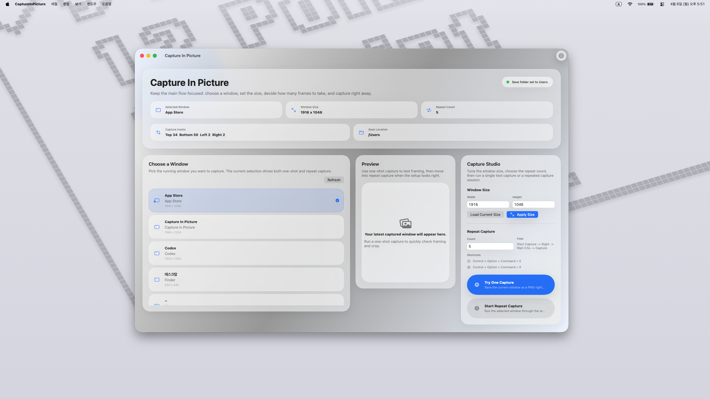
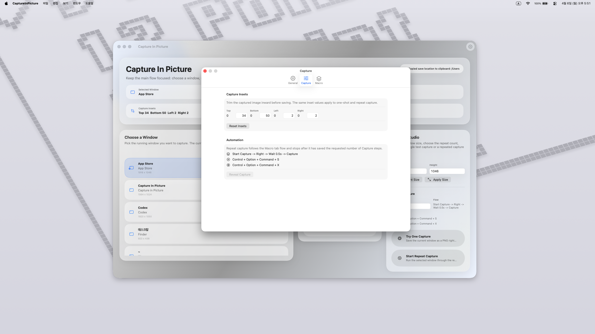
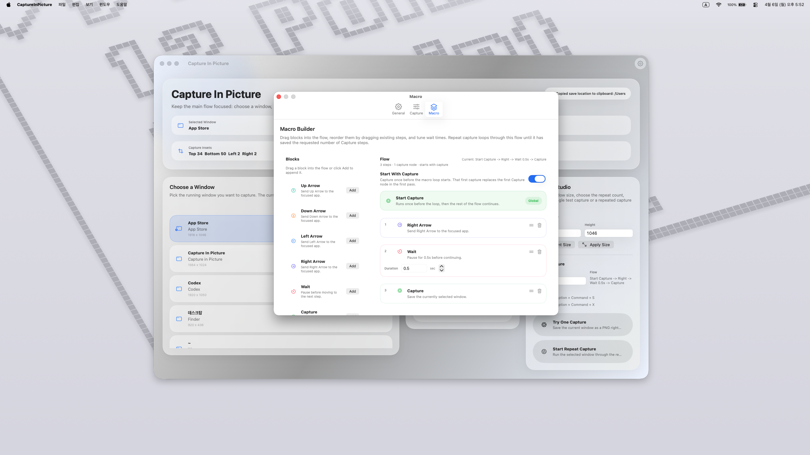

[한국어](README.ko.md) | [English](README.md)

# Capture In Picture

Capture In Picture는 특정 앱 창만 골라 PNG로 저장할 수 있는 macOS 캡처 앱입니다. 반복적인 문서 작성과 화면 기록 작업을 더 안정적으로 만들기 위한 도구를 함께 제공합니다.

튜토리얼 문서 작성자와 반복 화면 기록이 필요한 사용자를 위해 만들어졌으며, `macOS 26.2 or later`에서 동작합니다.

- [주요 기능](#주요-기능)
- [스크린샷](#스크린샷)
- [설치](#설치)
- [사용 방법](#사용-방법)
- [자주 묻는 질문](#자주-묻는-질문)
- [개인정보](#개인정보)
- [지원](#지원)
- [라이선스](#라이선스)

## 주요 기능

- 전체 화면이 아니라 원하는 앱 창만 선택해서 캡처할 수 있습니다.
- 캡처 전에 선택한 창 크기를 조절해 결과물을 일정하게 맞출 수 있습니다.
- 방향키, 대기, 캡처 스텝으로 반복 캡처용 매크로를 구성할 수 있습니다.
- 단일 캡처로 빠르게 결과를 확인하고, 반복 캡처 세션으로 여러 장을 연속 저장할 수 있습니다.
- 캡처 인셋을 사용해 저장 전에 이미지 가장자리를 안쪽으로 다듬을 수 있습니다.
- 사용자 지정 저장 폴더를 선택하거나 기본 경로인 `Pictures/CaptureInPicture`를 사용할 수 있습니다.
- 캡처 이미지를 외부로 업로드하지 않고 로컬 완료 알림만 표시할 수 있습니다.
- 무료로 사용할 수 있는 오픈소스 프로젝트입니다.

## 스크린샷

| 대시보드 | 일반 설정 |
| --- | --- |
|  |  |

| 캡처 설정 | 매크로 빌더 |
| --- | --- |
|  |  |

## 설치

- DMG: [GitHub Releases](https://github.com/Cogi-Code-Studio/Capture-In-Picture/releases)에서 최신 빌드를 다운로드할 수 있습니다.
- App Store: 최신 배포 상태는 [제품 페이지](https://studio.cogicode.com/products/capture-in-picture)에서 확인할 수 있습니다.
- 소스 실행: `CaptureInPicture.xcodeproj`를 Xcode에서 열고 `macOS 26.2 or later` 환경에서 실행할 수 있습니다.

## 사용 방법

1. 앱을 실행하고 `화면 기록` 권한을 허용합니다.
2. 창 크기 조절이나 반복 캡처 매크로를 쓰려면 `손쉬운 사용` 권한도 허용합니다.
3. 대시보드에서 캡처할 창을 선택합니다.
4. 필요하면 캡처 전에 창 크기를 먼저 맞춥니다.
5. **Try One Capture**로 구도, 크롭, 결과 크기를 먼저 확인합니다.
6. **Settings**에서 캡처 인셋, 저장 위치, 매크로 플로우를 조정합니다.
7. 같은 흐름을 여러 장 저장해야 할 때 **Repeat Capture**를 시작합니다.

반복 캡처 전역 단축키:

- 시작: `Control + Option + Command + S`
- 중지: `Control + Option + Command + X`

## 자주 묻는 질문

### 왜 화면 기록 권한이 필요한가요?

macOS에서는 다른 앱의 창 목록을 읽고 이미지를 캡처하려면 화면 기록 권한이 필요합니다.

### 왜 손쉬운 사용 권한이 필요한가요?

손쉬운 사용 권한은 선택한 창 크기를 조절하거나, 창에 포커스를 맞추거나, 반복 캡처 중 매크로 키 입력을 보내는 기능에만 사용됩니다.

### 캡처 파일은 어디에 저장되나요?

단일 캡처는 사용자가 선택한 폴더에 저장됩니다. 별도 폴더를 지정하지 않으면 `Pictures/CaptureInPicture`를 사용합니다. 반복 캡처는 기준 폴더 안에 타임스탬프 하위 폴더를 만들어 저장합니다.

### 매크로 빌더는 언제 유용한가요?

매크로 빌더는 방향키, 대기, 캡처 스텝을 조합해 반복 캡처 흐름을 만드는 기능입니다. UI 문서 작성이나 같은 순서를 여러 프레임으로 저장해야 할 때 특히 유용합니다.

### 캡처 이미지는 외부로 전송되나요?

아니요. 캡처된 이미지는 사용자의 Mac 안에만 남습니다. 앱은 계정을 요구하지 않으며, 캡처 이미지를 개발자 서버로 업로드하지 않습니다.

## 개인정보

- [Privacy Policy (English)](docs/privacy-policy.md)
- [개인정보 처리방침 (Korean)](docs/privacy-policy.ko.md)

## 지원

- 웹사이트: [studio.cogicode.com/products/capture-in-picture](https://studio.cogicode.com/products/capture-in-picture)
- 이메일: [admin@cogicode.com](mailto:admin@cogicode.com)
- 이슈 등록: [GitHub Issues](https://github.com/Cogi-Code-Studio/Capture-In-Picture/issues)

## 라이선스

MIT 라이선스를 사용합니다. 자세한 내용은 [LICENSE](LICENSE)를 참고해 주세요.
